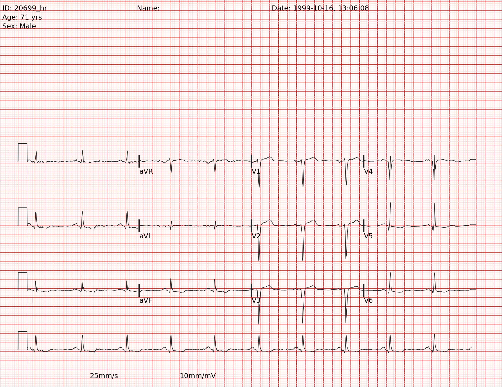

# Digitization of ECG Image

This project implements a deep learning pipeline to convert paper-based ECG images into digital signals (masks). It leverages a UNet architecture with a pre-trained ResNet34 encoder and a custom **Cross-Series Feature Fusion** module to accurately extract ECG leads from complex image backgrounds.

## 🚀 Project Overview

The goal of this project is to automate the digitization of ECG records. By converting visual ECG strips into pixel-level masks, we can reconstruct the original digital signal, enabling modern analytical tools to process historical or paper-based medical data.

## 🏗️ Architecture

The model uses a **UNet** backbone with several enhancements:
- **Encoder**: ResNet34 (Pre-trained on ImageNet) for robust feature extraction.
- **Cross-Series Feature Fusion**: A custom module that mixes information across different ECG series (leads) to improve consistency and noise reduction.
- **Head**: A pixel-wise classification head that predicts the probability of a signal being present at each coordinate.

### How it Works:
1. **Slicing**: The full ECG image is sliced into individual strips based on horizontal reference points (`zero_mv`).
2. **Feature Extraction**: Each strip is passed through the ResNet encoder.
3. **Fusion**: High-level features from all series are fused to capture global context.
4. **Decoding**: The fused features are upsampled to create a high-resolution mask of the ECG signal.

## 📊 Sample Data

Below are examples of the data used in this project:

| Original ECG Image | Pre-processed ECG Mask/Strip |
| :---: | :---: |
|  |  |

> [!NOTE]
> The original data shows a full 12-lead ECG, while the pre-processed data highlights the specific signal strips extracted for training the segmentation model.

## 🛠️ Installation & Setup

1. **Clone the repository**:
   ```bash
   git clone https://github.com/Aryankr0711/Digitization-of-ECG-Image.git
   cd Digitization-of-ECG-Image
   ```

2. **Install dependencies**:
   ```bash
   pip install torch torchvision albumentations segmentation-models-pytorch opencv-python pandas tqdm
   ```

3. **Prepare Data**:
   Place your raw images in a `train/` directory. Run the pre-processing script to generate masks.

## 📈 Training

To start the training process, run:
```bash
python train_reduced.py
```
Or use the provided Jupyter Notebook: `Train_main.ipynb`.

## 🛡️ License
This project is for research and educational purposes.
